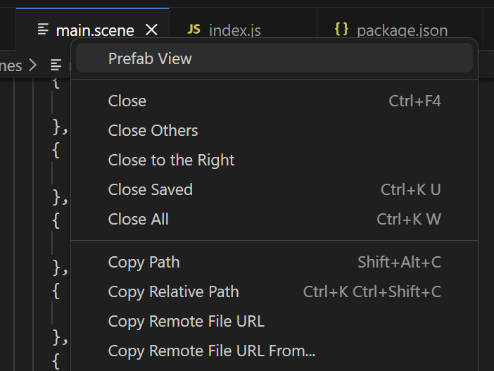
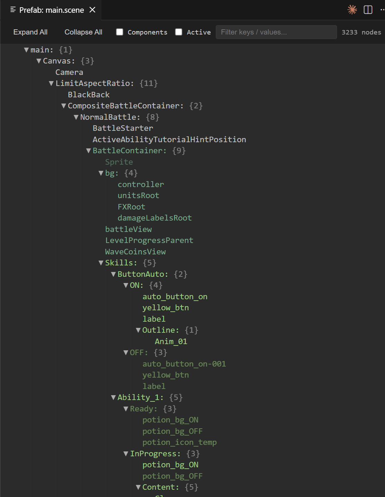
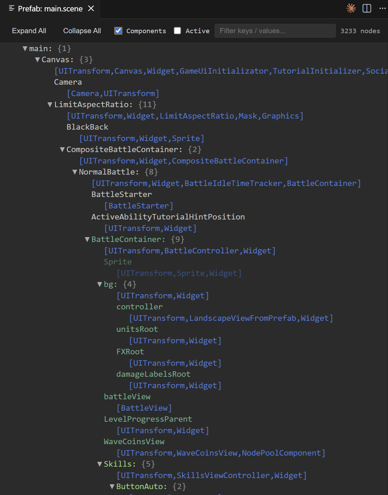
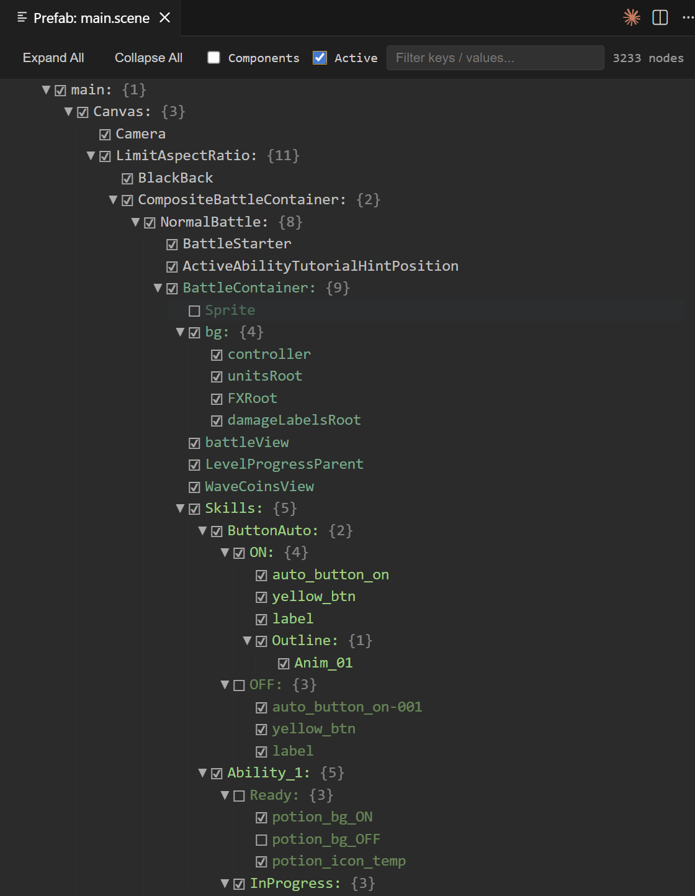

# Cocos Creator Prefab Viewer

A VS Code extension for browsing Cocos Creator `.prefab`, `.scene`, and `.fire` files as a readable, collapsible node tree instead of raw JSON — plus a standalone CLI for the same tree from the terminal.

Currenly works correctly with prefabs of Cocos Creator 3.x only.

## Features

Run the **Prefab View** command to open the currently active file — or a file/tab you right-click — in a dedicated read-only viewer tab.

### Readable node tree, not raw JSON

For a recognized `.prefab`/`.scene`/`.fire` asset, the file's raw serialized JSON is converted into an actual node tree before display:

- Node names instead of raw object graphs, with component lists resolved to readable names (script components resolve to their `.ts` file name; builtin components like `cc.Sprite` show as `Sprite`)
- Nested prefab instances are resolved and inlined as part of the tree, so you see the nested prefab's real structure instead of an opaque reference stub
- Any file that isn't a recognized prefab/scene (e.g. a plain `.json` file) falls back to showing its raw parsed JSON instead

### Tree viewer UI

- Collapsible tree with **Expand All** / **Collapse All** toolbar buttons
- Live filter box that searches node names and auto-expands matching branches
- Color-coded by nesting depth: ordinary nodes, first-level nested-prefab roots, and second-level-and-deeper nested-prefab roots each get a distinct color
- **Components** checkbox (hidden by default) to show/hide each node's `[Component1,Component2,...]` list
- **Active** checkbox (hidden by default) to show a ☑/☐ marker per node reflecting its own `_active` flag
- Inactive nodes — and their entire subtree, since an inactive node hides everything under it too — render at ~35% reduced brightness
- A background progress indicator shows while the tree is being built, for large projects where that walk takes a moment
- Re-invoking the command on an already-open file reveals its existing tab instead of opening a duplicate

### Usage

- Activate from context menu

- Default view

- With component names

- With active flags


### Running the command

- **Command Palette**: run `Cocos Creator: Prefab View` while a file is open in the active editor
- **Explorer context menu**: right-click a `.prefab`, `.scene`, `.fire`, or `.json` file
- **Editor tab context menu**: right-click the tab of an open `.prefab`, `.scene`, `.fire`, or `.json` file

## CLI tool

`tools/prefab-viewer.ts` prints the same node tree to the terminal (or a file), independent of VS Code:

```
npx tsx tools/prefab-viewer.ts <path-or-name-or-glob> [--output=<file>] [--components[=suffix|child]] [--format=text|json] [--nesting-depth=<n>]
```

The target asset can be an exact path, a bare name/partial path to search for under `assets/`, or a glob. See the file's header comment for the full option reference (`--components`, `--format=text|json`, `--nesting-depth`, `--output`).

## Requirements

No external dependencies or configuration required. The CLI tool requires running from within a Cocos Creator project (an `assets/` folder alongside the target asset).

## Extension Settings

This extension does not currently contribute any VS Code settings.

## Known Issues

- Very large prefab/scene files may render slowly since the entire tree is built up front.

## Release Notes

### 0.1.0

Initial release: adds the **Prefab View** command with a collapsible, color-coded node tree viewer, plus the standalone `tools/prefab-viewer.ts` CLI.

**Enjoy!**
